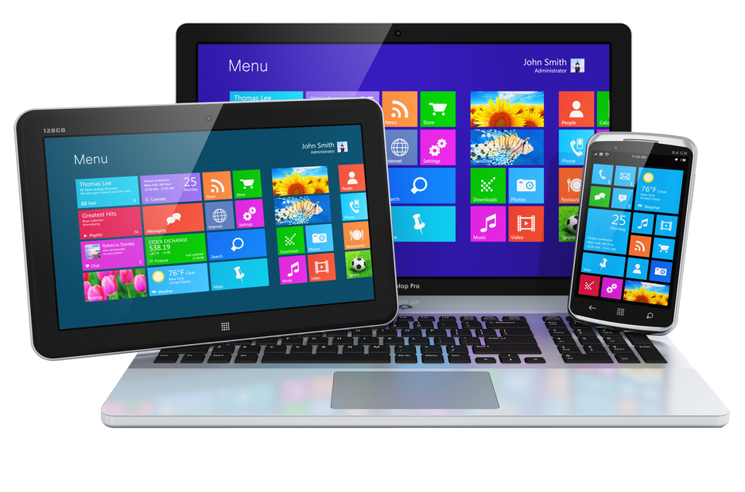
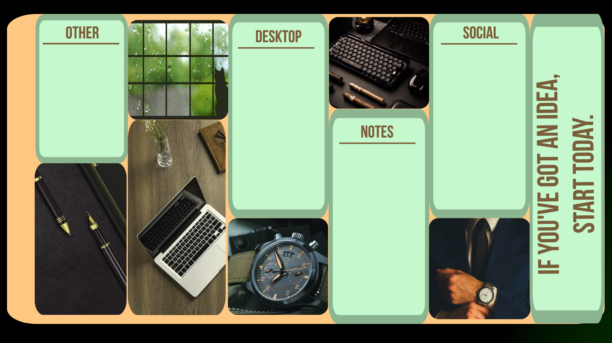
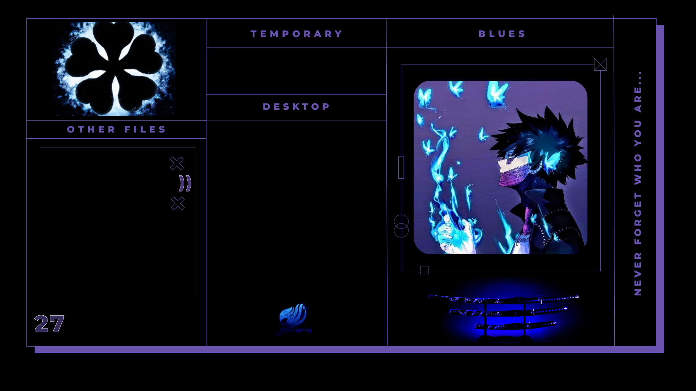
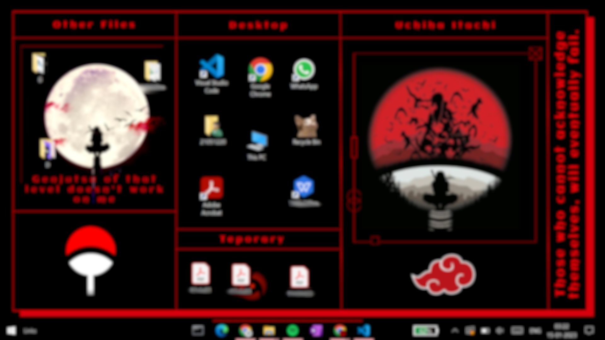
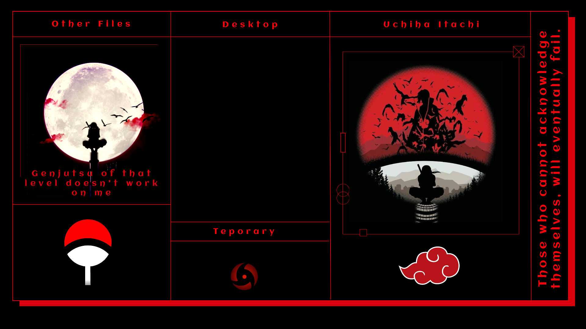
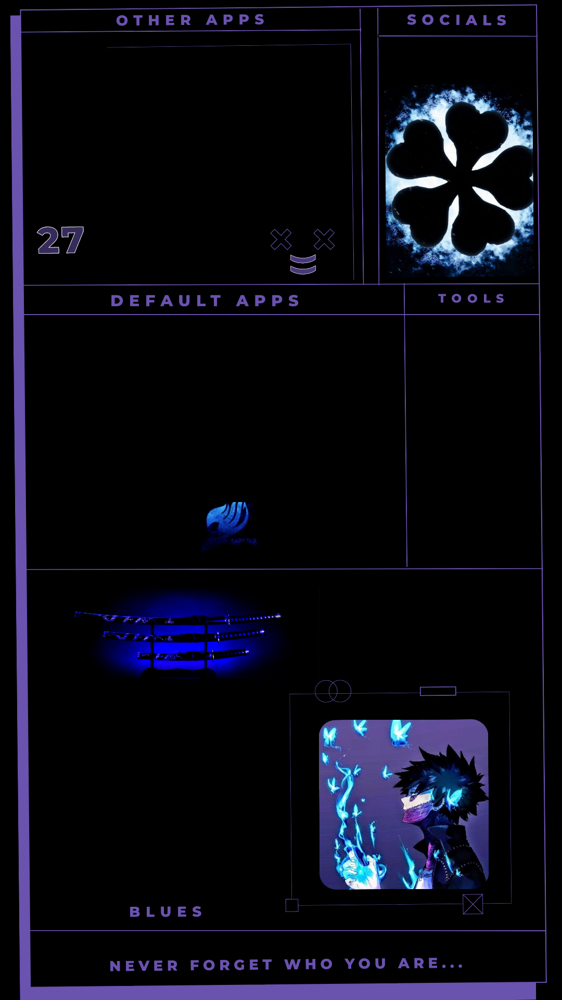

# Wallpaper-Site

<!DOCTYPE html>
<html>

<head>
  <meta charset="utf-8">
  <title>HzWallpaper</title>
  <link rel="preconnect" href="https://fonts.googleapis.com">
  <link rel="preconnect" href="https://fonts.gstatic.com" crossorigin>
  <link href="https://fonts.googleapis.com/css2?family=Roboto&family=Satisfy&display=swap" rel="stylesheet">
  <link href="https://cdn.jsdelivr.net/npm/bootstrap@5.3.0-alpha1/dist/css/bootstrap.min.css" rel="stylesheet"
    integrity="sha384-GLhlTQ8iRABdZLl6O3oVMWSktQOp6b7In1Zl3/Jr59b6EGGoI1aFkw7cmDA6j6gD" crossorigin="anonymous">
  
  <link rel="stylesheet" href="css/styles.css" class="theme">
  <link rel="stylesheet" href="css/switch.css">
  
  <!--
  
  -->
  

</head>

<body class="main">

  <section id="title">

    

      <!-- Nav Bar -->
      <nav class="navbar navbar-expand-lg">
        <a class="navbar-brand" href="">HzWallpaper</a>
        

          <ul class="navbar-nav ml-auto">
            <li class="nav-item">
              <a class="nav-link" href="mailto:playgamegamerszone@gmail.com"">Contact</a>
            </li>
            <li class=" nav-item">
                <a class="nav-link" href="#features">Features</a>
            </li>
            <li class="nav-item">
              <a class="nav-link" href="#testimonials">Testimonials</a>
            </li>
          </ul>
        

      </nav>

      <!-- Title -->

      

        

          <h1 class="title-text">Download organised wallpapers for your PC and Smartphone.</h1>
          <button type="button" class="btn btn-dark btn-lg"><a href="#Download" class="title-btn-pc"> Download</button></a>
          <button type="button" class="btn btn-outline-dark btn-lg"><a href="#mbwallpapers" class="title-btn-mb"> Download</button></a>
        

        

          
        

        

          <input type="checkbox" id="toggle_checkbox"
            onclick="toggleTheme('css/dark.css'); toggleTheme('css/styles.css')">
          <label for="toggle_checkbox" class="switchH">
            

              
★

              
★

            

            

          </label>
        

      

    

  </section>

  <!-- Features -->

  <section id="features">

    

      

        
        <h3>Easy to Organise.</h3>
        
Simple and Time saving.

      

      

        
        
        <h3>Different Categories</h3>
        
We have all the types of wallpapers based on your desrie.

      

      

        
        <h3>Guaranteed to work.</h3>
        
I mean...You just have to set them as backgroud image.

      

    

  </section>

  <!-- Testimonials -->
  <section id="testimonials">

    

      

        

          <h2 class="testimonial">Found the perfect wallpaper for both my Personal and work Devices.</h2>
          
          <em>Viraj, Bangalore</em>
        

        

          <h2 class="testimonial">These wallpapers make my PC desktop look a lot more presentable.</h2>
          
          <em>Anshuman, Mumbai</em>
        

        

          <h2 class="testimonial">I no longer have to keep seperating and rearranging my desktop. Really very helpful.
          </h2>
          
          <em>Jaydeep, Delhi</em>
        

      

      <button class="carbtn carousel-control-prev" type="button" data-bs-target="#carouselExampleAutoplaying"
        data-bs-slide="prev">
        
        Previous
      </button>
      <button class="carbtn carousel-control-next" type="button" data-bs-target="#carouselExampleAutoplaying"
        data-bs-slide="next">
        
        Next
      </button>
    

  </section>

  <!-- Download -->

  <section id="Download">

    <h2>A Wallpaper for Every User's Needs</h2>
    
Simple and Stunning wallpapers for you device

    

      

        

          

            <h3>Professional Desktop</h3>
          

          

            <h2>Free</h2>
            

              <a href="images/testimonial2.png" download="Calm_Green"><button class="down-one">Download</button></a>

            
Different Fields for Organisation

            
Productive and Professional Look

            <button class="btn btn-lg btn-block btn-primary" type="button"> Download All</button>
          

        

      

      

        

          

            <h3>Desktop Wallpapers</h3>
          

          

            <h2>Free</h2>
            

              <a href="images/testimonial3.png" download="Anime_Blues"><button class="down-one">Download</button></a>

            

              <a href="images/testimonial4.png" download="Uchiha_Itachi"><button class="down-one">Download</button></a>

            
Different Themed wallpapers for your PC

            <button class="btn btn-lg btn-block btn-primary" type="button"> Download
              All</button>
          

        

      

      

        

          

            <h3>Mobile Wallpapers</h3>
          

          

            <h2>Free</h2>
            

              <a href="images/mpic1.jpg" download="Samurai"><button class="down-one">Download</button></a>

            

              <a href="images/mpic2.png" download="Anime_Blues_mb"><button class="down-one">Download</button></a>

            

              <a href="images/mpic3.jpeg" download="Scenery"><button class="down-one">Download</button></a>

            
Organised wallpapers for your mobile devices

            <button class="btn btn-lg btn-block btn-primary" type="button"> Download
              All</button>
          

        

      

    

  </section>

  <footer id="footer">

    <section id="cta">
      <h3>Find the Perfect wallpaper for your PC/Mobile.</h3>
      <button type="button" class="btn btn-dark btn-lg"><a href="#d-wallpapers" class="title-btn-pc"> Download</a></button>
      <button type="button" class="btn btn-outline-dark btn-lg"><a href="#mbwallpapers" class="title-btn-mb"> Download</a></button>
    </section>
    <a href="mailto:playgamegamerszone@gmail.com" class="nav-link">Contact</a>
    
© Copyright HzWallpaper

  </footer>

</body>

</html>
